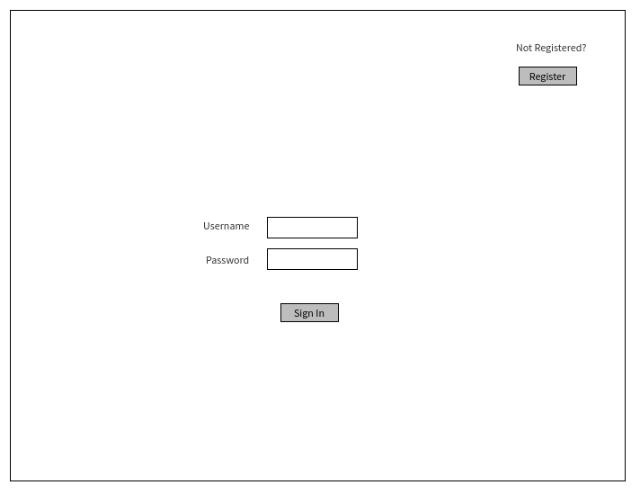
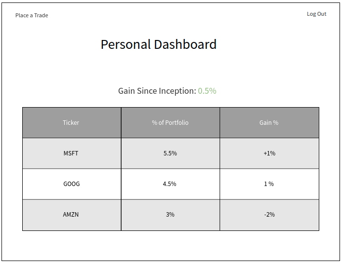
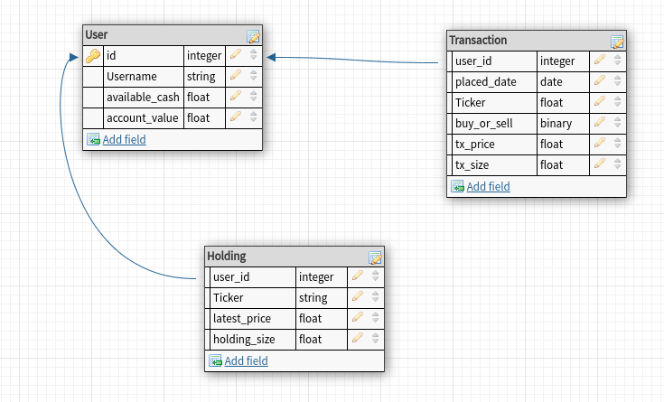

# Stonkhub

The paper-trading (fake money) social network. Place trades, track your performance, share ideas with others.

**MVP Goals** 

* authentication/authorization
* Place Trade + comment on trade
* Track user’s own performance

**Stretch Goals**  

* lookup other users, view performance, view trades
* follow other users
* add friend, create and join discussion groups

  
    *Daily Sprints*
    - Monday:
      * test API
      * wireframe app
      * plan database ERD
      * plan routes
    - Tuesday:
      * create db models -- test db
      * stub routes -- test routes
      * build routes
    - Wednesday:
      * finish routes
      * create views
    - Thursday:
      * finish views
      * mvp
    - Friday:
      * debug refactor
      * style views
    - Saturday:
      * style views
      * stretch goals
    - Sunday:
      * stretch goals

 **Wireframes**

ROUTES:

| Method | URL | Functionality | view |
|--------|-----|---------------|------|
| GET  | /dashboard | Retrieve current position value | show dashboard.ejs
| POST | /transaction | place buy or sell order | show confirmation.ejs
| GET  | /stocks/:ticker | Retrieve quote for ticker |  show ticker.ejs
| GET  | /stocks | Display search screen |  show stocks.ejs

<!-- | PUT  | /user/:id/aboutme | update profile | redirect to profile.ejs -->
<!-- | DELETE | /books/:id | delete one book | redirect to /books -->

 **ERDs**

  

